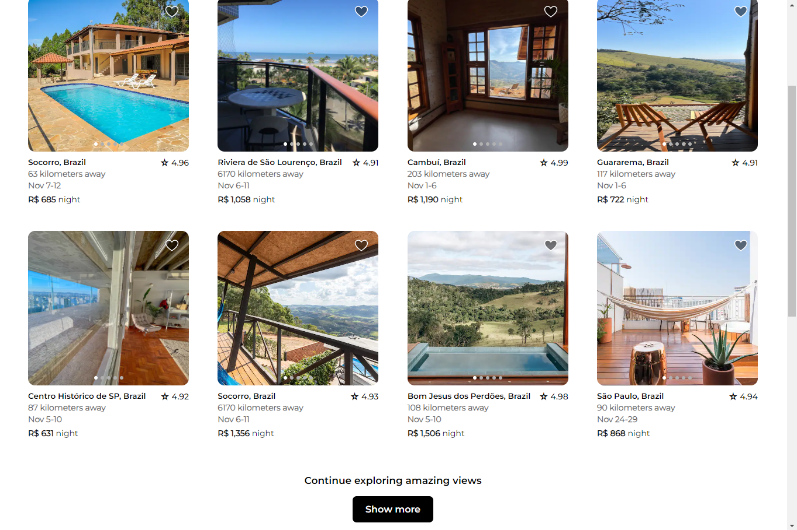

# Airbnb-layout
This project is part of the HTML & CSS course at [O Novo Programador](https://onovoprogramador.com/) programming school. The objective was to recreate the layout of the Airbnb website using HTML and CSS.

Here are screenshots of the final result:

    

    

